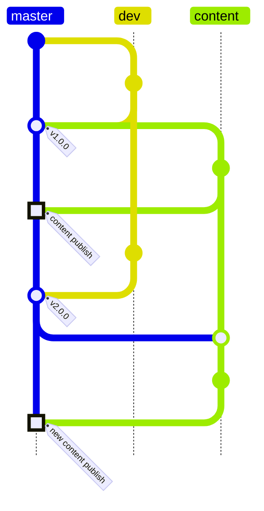

# Astro Blog

This project is a follow along of the Astro tutorials:
1. [Build your first Astro Blog](https://docs.astro.build/en/tutorial/0-introduction/)
2. [Extend with Content Collections](https://docs.astro.build/en/tutorials/add-content-collections/)
3. [Extend with View Transitions](https://docs.astro.build/en/tutorials/add-view-transitions/)     <-- This is where we are at

## Branches
I decided to create a new branch where content will be created, edited, etc. Then, the branches scheme looks like this:

### Branches description
- **master**: Main branch, where the project is built and deployed.
- **dev**: Development branch, where new features are developed.
- **content**: Branch where content is created, edited, etc.

### Workflow
* Develop on dev branch.
* Merge dev into master when a new feature is ready. always add tags.
* Merge master into content when a new feature is published, this way the content is updated with the latest changes, but it is not published straight away.
* Merge content into master when new content is published. IMPORTANT: Do this trough a pull request.
* Merge master into dev to keep the development branch updated.

NOTE2SELF: consider some way of automating some of these processes with GitHub Actions or similar.

## License
This project is open source and available under the [MIT License](LICENSE).